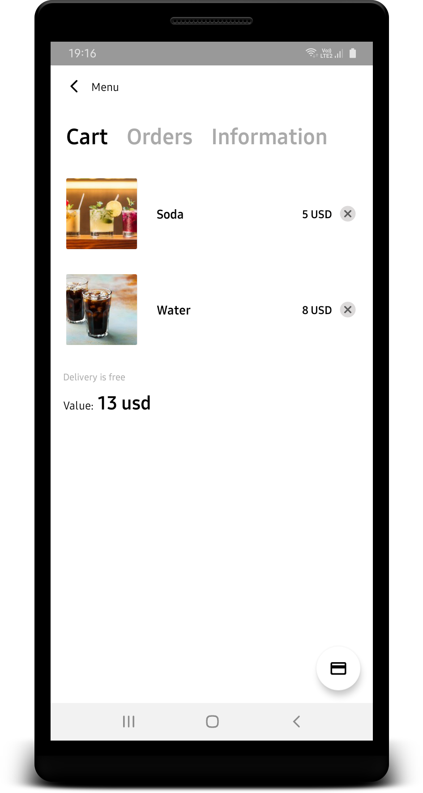

# eatit
Android Sample Modular Architecture App is written in Kotlin. ([MVVM](https://g.co/kgs/pjZHLc), [Hilt](https://dagger.dev/hilt/), [RxJava](https://github.com/ReactiveX/RxJava), [Epoxy](https://github.com/airbnb/epoxy), [MvRx](https://github.com/airbnb/MvRx))

### Design

  
  &nbsp;&nbsp;&nbsp;&nbsp;
  &nbsp;&nbsp;&nbsp;&nbsp;
  &nbsp;&nbsp;&nbsp;&nbsp;
  

### Architecture
...

### Contributing
Your contributions are always welcomed but for easier and faster code review please consider:

* Feature branches are created from develop
* When a feature is complete it is merged into the develop
* Create a descriptively named branch
* Every branch should only fix one issue, this way branches can be merged easier
* Each commit should only change one thing, this way commits can be reverted easier
* When you need feedback or help, or you think the branch is ready for merging, open a pull request
* Refrain from adding tools and technologies that increase the complexity of the project
